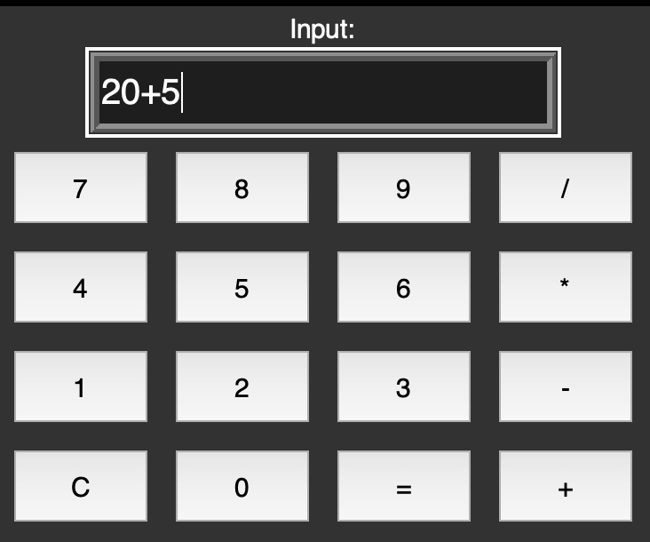
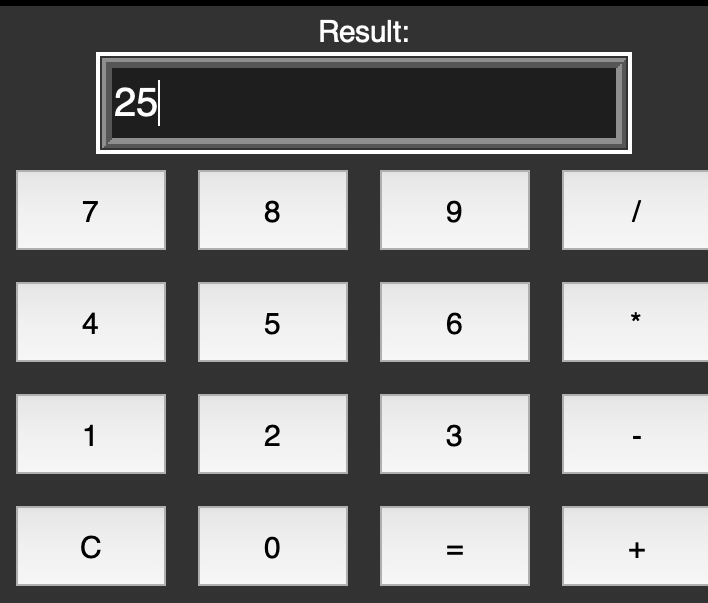

# Simple GUI Calculator

## Description
This project is a simple calculator built using Python and Tkinter. It supports basic arithmetic operations such as addition, subtraction, multiplication, and division. The application provides a user-friendly graphical interface for performing calculations.

## Features
- Simple and intuitive GUI for performing calculations.
- Supports basic operations: `+`, `-`, `*`, `/`.
- Error handling for invalid input (e.g., non-numeric input or division by zero).

## How to Run the Project
1. Clone the repository:
   ```bash
   git clone https://github.com/RachitTyagi17/Simple_Gui_calculator.git


## Screenshots
Here are the screenshots of the Simple GUI Calculator:

### Screenshot 1:


### Screenshot 2:


### Screenshot 3:


### Screenshot 4:
